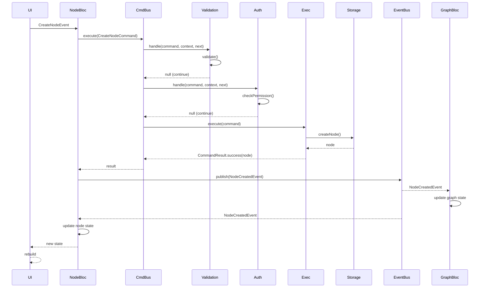
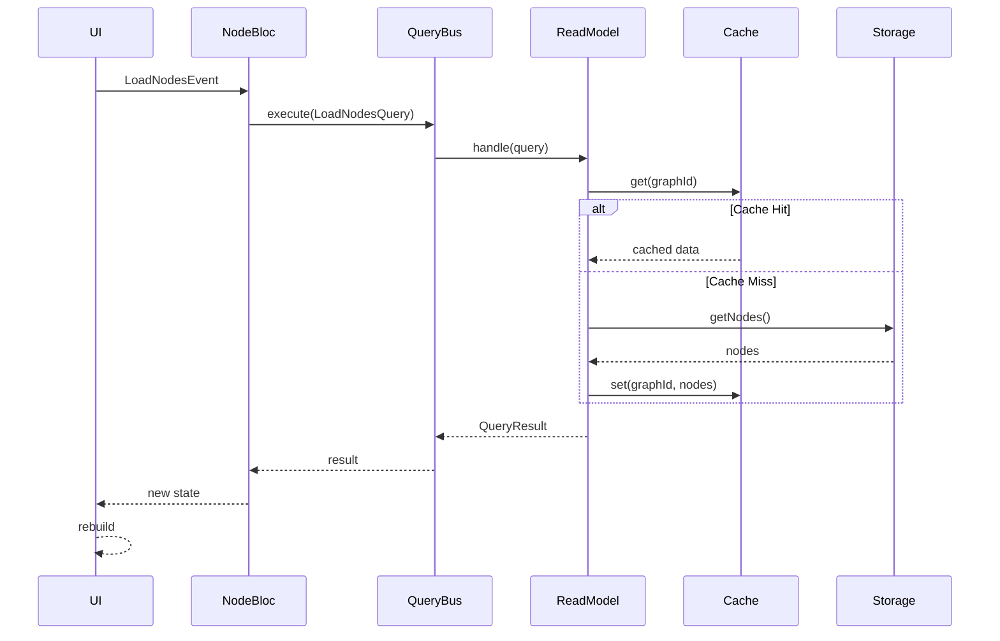

# 组件交互设计

## 1. 概述

### 1.1 职责
本文档描述 Node Graph Notebook 中各组件之间的交互协议，包括：
- 组件间的通信方式
- 接口定义和契约
- 交互时序
- 错误处理

### 1.2 目标
- **松耦合**: 组件间最小依赖
- **可测试**: 支持依赖注入和 Mock
- **可扩展**: 易于添加新组件
- **类型安全**: 编译时类型检查

### 1.3 关键挑战
- **跨层通信**: UI 到 Storage 的多层通信
- **异步协调**: 异步操作的时序保证
- **状态同步**: 多个 BLoC 的状态一致性
- **错误传播**: 错误的正确传递和处理

## 2. 组件交互架构

### 2.1 交互层次

```
┌─────────────────────────────────────────────────────────────┐
│                    组件交互层次                             │
└─────────────────────────────────────────────────────────────┘

Level 1: UI ↔ BLoC (State Management)
  - Stream-based communication
  - BlocBuilder, BlocListener
  - context.watch, context.read

Level 2: BLoC ↔ BLoC (Cross-BLoC Communication)
  - EventBus (publish-subscribe)
  - State sharing (via Repository)

Level 3: BLoC ↔ Command/Query Bus (CQRS)
  - Command dispatch
  - Query execution
  - Result handling

Level 4: Command/Query Bus ↔ Execution Engine
  - Command/Queue submission
  - Async execution
  - Callback/Stream result

Level 5: Execution Engine ↔ Storage
  - Repository interface
  - Transaction control
  - Batch operations
```

### 2.2 交互模式

| 模式 | 使用场景 | 实现方式 |
|------|----------|----------|
| **Request-Response** | 同步查询 | QueryBus.execute() |
| **Fire-and-Forget** | 异步命令 | CommandBus.execute() |
| **Publish-Subscribe** | 跨 BLoC 通知 | EventBus.publish() |
| **Stream** | 状态更新 | BLoC state stream |
| **Callback** | 执行结果 | Future.then() |

## 3. 接口定义

### 3.1 BLoC ↔ UI 接口

#### NodeBloc 接口

```dart
/// Node 状态管理 BLoC
class NodeBloc extends Bloc<NodeEvent, NodeState> {
  /// 构造函数
  NodeBloc({
    required CommandBus commandBus,
    required QueryBus queryBus,
    required AppEventBus eventBus,
  }) : super(NodeInitial()) {
    // 注册事件处理器
    on<LoadNodesEvent>(_onLoadNodes);
    on<CreateNodeEvent>(_onCreateNode);
    on<UpdateNodeEvent>(_onUpdateNode);
    on<DeleteNodeEvent>(_onDeleteNode);
    on<SelectNodeEvent>(_onSelectNode);

    // 订阅全局事件
    _eventSubscription = eventBus.stream.listen(_onGlobalEvent);
  }

  /// 状态
  final StreamSubscription? _eventSubscription;

  /// 事件处理器
  Future<void> _onLoadNodes(
    LoadNodesEvent event,
    Emitter<NodeState> emit,
  ) async {
    emit(state.copyWith(loading: true));

    try {
      final query = LoadNodesQuery(
        graphId: event.graphId,
        includeReferences: true,
      );

      final result = await _queryBus.execute(query);

      emit(state.copyWith(
        nodes: result.nodes,
        loading: false,
      ));
    } catch (e) {
      emit(state.copyWith(
        error: e.toString(),
        loading: false,
      ));
    }
  }

  Future<void> _onCreateNode(
    CreateNodeEvent event,
    Emitter<NodeState> emit,
  ) async {
    final command = CreateNodeCommand(
      type: event.type,
      data: event.data,
      parentId: event.parentId,
    );

    final result = await _commandBus.execute(command);

    if (result.isSuccess) {
      // 节点创建成功，等待事件通知更新状态
      // 不直接更新，而是通过 EventBus
    } else {
      emit(state.copyWith(error: result.error));
    }
  }

  void _onGlobalEvent(AppEvent event) {
    if (event is NodeDataChangedEvent) {
      // 更新本地状态
      final updatedNodes = Map<String, Node>.from(state.nodes);
      for (final node in event.changedNodes) {
        updatedNodes[node.id] = node;
      }
      emit(state.copyWith(nodes: updatedNodes));
    }
  }

  @override
  Future<void> close() {
    _eventSubscription?.cancel();
    return super.close();
  }
}
```

#### UI 使用示例

```dart
/// 监听状态变化
class NodeListWidget extends StatelessWidget {
  @override
  Widget build(BuildContext context) {
    return BlocBuilder<NodeBloc, NodeState>(
      builder: (context, state) {
        if (state.loading) {
          return CircularProgressIndicator();
        }

        if (state.error != null) {
          return Text('错误: ${state.error}');
        }

        return ListView.builder(
          itemCount: state.nodes.length,
          itemBuilder: (context, index) {
            final node = state.nodes.values.elementAt(index);
            return NodeListItem(node: node);
          },
        );
      },
    );
  }
}

/// 触发事件
class CreateNodeButton extends StatelessWidget {
  @override
  Widget build(BuildContext context) {
    return ElevatedButton(
      onPressed: () {
        context.read<NodeBloc>().add(CreateNodeEvent(
          type: NodeType.concept,
          data: NodeData(title: '新节点'),
        ));
      },
      child: Text('创建节点'),
    );
  }
}
```

### 3.2 BLoC ↔ BLoC 接口

#### EventBus 定义

```dart
/// 应用事件总线
class AppEventBus {
  final StreamController<AppEvent> _controller =
      StreamController<AppEvent>.broadcast();

  /// 事件流
  Stream<AppEvent> get stream => _controller.stream;

  /// 发布事件
  void publish(AppEvent event) {
    _controller.add(event);
  }

  /// 释放资源
  void dispose() {
    _controller.close();
  }
}

/// 基础事件类
abstract class AppEvent {
  final DateTime timestamp;
  AppEvent() : timestamp = DateTime.now();
}

/// 节点数据变更事件
class NodeDataChangedEvent extends AppEvent {
  final List<Node> changedNodes;
  final DataChangeAction action;

  NodeDataChangedEvent({
    required this.changedNodes,
    required this.action,
  });
}

/// 数据变更动作
enum DataChangeAction {
  create,
  update,
  delete,
}
```

#### 跨 BLoC 通信示例

```dart
/// GraphBloc 订阅节点变更
class GraphBloc extends Bloc<GraphEvent, GraphState> {
  final AppEventBus _eventBus;
  StreamSubscription? _nodeSubscription;

  GraphBloc(this._eventBus) : super(GraphInitial()) {
    // 订阅节点变更事件
    _nodeSubscription = _eventBus.stream.listen((event) {
      if (event is NodeDataChangedEvent) {
        _handleNodeChanged(event);
      }
    });
  }

  void _handleNodeChanged(NodeDataChangedEvent event) {
    switch (event.action) {
      case DataChangeAction.create:
        // 新建节点，添加到图
        add(AddNodeToGraphEvent(event.changedNodes.first.id));
        break;
      case DataChangeAction.update:
        // 更新节点
        add(UpdateNodeInGraphEvent(event.changedNodes.first));
        break;
      case DataChangeAction.delete:
        // 删除节点
        add(RemoveNodeFromGraphEvent(event.changedNodes.first.id));
        break;
    }
  }

  @override
  Future<void> close() {
    _nodeSubscription?.cancel();
    return super.close();
  }
}
```

### 3.3 Command Bus 接口

#### Command 基类

```dart
/// Command 基类
abstract class Command {
  /// Command 类型标识
  Type get type => runtimeType;

  /// 验证 Command
  ValidationResult validate();
}

/// 验证结果
class ValidationResult {
  final bool isValid;
  final List<String> errors;

  ValidationResult.success()
      : isValid = true,
        errors = const [];

  ValidationResult.failure(this.errors) : isValid = false;
}
```

#### CommandBus 接口

```dart
/// Command Bus 接口
abstract class ICommandBus {
  /// 执行单个 Command
  Future<CommandResult> execute(Command command);

  /// 批量执行 Commands
  Future<List<CommandResult>> executeBatch(List<Command> commands);

  /// 添加中间件
  void addMiddleware(CommandMiddleware middleware);

  /// 订阅 Command 结果
  Stream<CommandResult> get results;
}

/// Command 中间件
abstract class CommandMiddleware {
  /// 处理 Command
  Future<CommandResult?> handle(
    Command command,
    CommandContext context,
    NextMiddleware next,
  );
}

/// 中间件处理函数
typedef NextMiddleware = Future<CommandResult> Function(
  Command command,
  CommandContext context,
);

/// Command 执行上下文
class CommandContext {
  final Map<String, dynamic> metadata;
  final Stopwatch stopwatch;

  CommandContext() : metadata = {}, stopwatch = Stopwatch();

  T get<T>(String key) => metadata[key] as T;
  void set<T>(String key, T value) => metadata[key] = value;
}

/// Command 执行结果
class CommandResult {
  final bool isSuccess;
  final dynamic data;
  final String? error;

  CommandResult.success(this.data)
      : isSuccess = true,
        error = null;

  CommandResult.failure(this.error)
      : isSuccess = false,
        data = null;
}
```

#### CommandBus 实现

```dart
/// Command Bus 实现
class CommandBus implements ICommandBus {
  final List<CommandMiddleware> _middlewares = [];
  final StreamController<CommandResult> _resultController =
      StreamController.broadcast();

  @override
  Future<CommandResult> execute(Command command) async {
    // 验证
    final validation = command.validate();
    if (!validation.isValid) {
      return CommandResult.failure(
        '验证失败: ${validation.errors.join(", ")}',
      );
    }

    // 创建上下文
    final context = CommandContext();
    context.stopwatch.start();

    // 执行中间件链
    int index = 0;

    Future<CommandResult> next(
      Command cmd,
      CommandContext ctx,
    ) async {
      if (index < _middlewares.length) {
        final middleware = _middlewares[index++];
        final result = await middleware.handle(cmd, ctx, next);
        if (result != null) {
          return result;
        }
      }
      // 所有中间件执行完毕，返回成功
      return CommandResult.success(null);
    }

    try {
      final result = await next(command, context);
      _resultController.add(result);
      return result;
    } catch (e) {
      final result = CommandResult.failure(e.toString());
      _resultController.add(result);
      return result;
    }
  }

  @override
  void addMiddleware(CommandMiddleware middleware) {
    _middlewares.add(middleware);
  }

  @override
  Stream<CommandResult> get results => _resultController.stream;
}
```

### 3.4 Query Bus 接口

#### Query 基类

```dart
/// Query 基类
abstract class Query<TResult> {
  /// Query 类型标识
  Type get type => runtimeType;
}
```

#### QueryBus 接口

```dart
/// Query Bus 接口
abstract class IQueryBus {
  /// 执行 Query
  Future<TResult> execute<TResult>(Query<TResult> query);

  /// 注册 Query Handler
  void registerHandler<TResult>(
    Type queryType,
    QueryHandler<TResult> handler,
  );
}

/// Query Handler
typedef QueryHandler<TResult> = Future<TResult> Function(
  Query query,
);
```

#### QueryBus 实现

```dart
/// Query Bus 实现
class QueryBus implements IQueryBus {
  final Map<Type, QueryHandler> _handlers = {};

  @override
  void registerHandler<TResult>(
    Type queryType,
    QueryHandler<TResult> handler,
  ) {
    _handlers[queryType] = handler;
  }

  @override
  Future<TResult> execute<TResult>(Query<TResult> query) async {
    final handler = _handlers[query.type];

    if (handler == null) {
      throw UnimplementedError(
        '未找到 ${query.type} 的 Handler',
      );
    }

    return await handler(query) as TResult;
  }
}
```

## 4. 交互时序

### 4.1 创建节点时序



### 4.2 查询节点时序



## 5. 错误处理

### 5.1 错误类型定义

```dart
/// 基础错误类
abstract class AppException implements Exception {
  final String message;
  final dynamic originalError;

  AppException(this.message, [this.originalError]);

  @override
  String toString() => message;
}

/// 验证错误
class ValidationException extends AppException {
  ValidationException(String message) : super(message);
}

/// 授权错误
class AuthorizationException extends AppException {
  AuthorizationException(String message) : super(message);
}

/// 存储错误
class StorageException extends AppException {
  StorageException(String message, [dynamic originalError])
      : super(message, originalError);
}

/// 冲突错误
class ConflictException extends AppException {
  ConflictException(String message) : super(message);
}

/// 未找到错误
class NotFoundException extends AppException {
  NotFoundException(String message) : super(message);
}
```

### 5.2 错误处理策略

```dart
/// BLoC 错误处理
Future<void> _onCreateNode(
  CreateNodeEvent event,
  Emitter<NodeState> emit,
) async {
  try {
    final command = CreateNodeCommand(...);
    final result = await _commandBus.execute(command);

    if (result.isSuccess) {
      // 成功，等待事件通知
    } else {
      emit(state.copyWith(error: result.error));
    }
  } on ValidationException catch (e) {
    // 验证错误，显示给用户
    emit(state.copyWith(error: e.message));
  } on AuthorizationException catch (e) {
    // 授权错误，提示用户
    emit(state.copyWith(error: '权限不足: ${e.message}'));
  } on StorageException catch (e) {
    // 存储错误，显示错误信息
    emit(state.copyWith(error: '存储失败: ${e.message}'));
  } catch (e) {
    // 未知错误
    emit(state.copyWith(error: '未知错误: ${e.toString()}'));
  }
}
```

### 5.3 错误恢复

```dart
/// 重试机制
class RetryMiddleware extends CommandMiddleware {
  final int maxRetries;
  final Duration delay;

  RetryMiddleware({
    this.maxRetries = 3,
    this.delay = const Duration(milliseconds: 100),
  });

  @override
  Future<CommandResult?> handle(
    Command command,
    CommandContext context,
    NextMiddleware next,
  ) async {
    int attempts = 0;

    while (attempts < maxRetries) {
      try {
        return await next(command, context);
      } on StorageException catch (e) {
        attempts++;
        if (attempts >= maxRetries) {
          return CommandResult.failure('重试 ${attempts} 次后失败: ${e.message}');
        }
        await Future.delayed(delay * attempts);
      }
    }

    return CommandResult.failure('超过最大重试次数');
  }
}
```

## 6. 性能考虑

### 6.1 批量操作接口

```dart
/// 批量 Command 执行
extension CommandBusBatch on ICommandBus {
  Future<List<CommandResult>> executeBatch(
    List<Command> commands,
  ) async {
    final results = <CommandResult>[];

    for (final command in commands) {
      final result = await execute(command);
      results.add(result);
    }

    return results;
  }
}
```

### 6.2 并发限制

```dart
/// 并发限制中间件
class ConcurrencyLimitMiddleware extends CommandMiddleware {
  final int maxConcurrent;
  final Queue<_PendingRequest> _queue = Queue();
  int _running = 0;

  ConcurrencyLimitMiddleware({this.maxConcurrent = 10});

  @override
  Future<CommandResult?> handle(
    Command command,
    CommandContext context,
    NextMiddleware next,
  ) async {
    final completer = Completer<CommandResult>();

    _queue.add(_PendingRequest(command, context, completer, next));
    _processQueue();

    return completer.future;
  }

  void _processQueue() async {
    if (_running >= maxConcurrent || _queue.isEmpty) return;

    _running++;
    final request = _queue.removeFirst();

    try {
      final result = await request.next(request.command, request.context);
      request.completer.complete(result);
    } catch (e) {
      request.completer.complete(CommandResult.failure(e.toString()));
    } finally {
      _running--;
      _processQueue();
    }
  }
}

class _PendingRequest {
  final Command command;
  final CommandContext context;
  final Completer<CommandResult> completer;
  final NextMiddleware next;

  _PendingRequest(
    this.command,
    this.context,
    this.completer,
    this.next,
  );
}
```

## 7. 关键文件清单

```
lib/core/
├── command_bus/
│   ├── command.dart
│   ├── command_bus.dart
│   ├── command_context.dart
│   ├── command_result.dart
│   └── middleware/
│       ├── middleware.dart
│       ├── validation.dart
│       ├── authorization.dart
│       ├── retry.dart
│       └── concurrency_limit.dart
├── query_bus/
│   ├── query.dart
│   ├── query_bus.dart
│   └── query_handler.dart
└── events/
    ├── app_events.dart
    └── event_bus.dart
```

## 8. 参考资料

### 设计模式
- Mediator Pattern - Command/Query Bus
- Observer Pattern - EventBus
- Middleware Pattern - Pipeline
- Repository Pattern - Storage Abstraction

### 异步编程
- Dart Futures and Streams
- Async/Await Best Practices
- Error Handling in Async Code

---

**文档所有者**: Node Graph Notebook 架构组
**最后更新**: 2025-01-14
