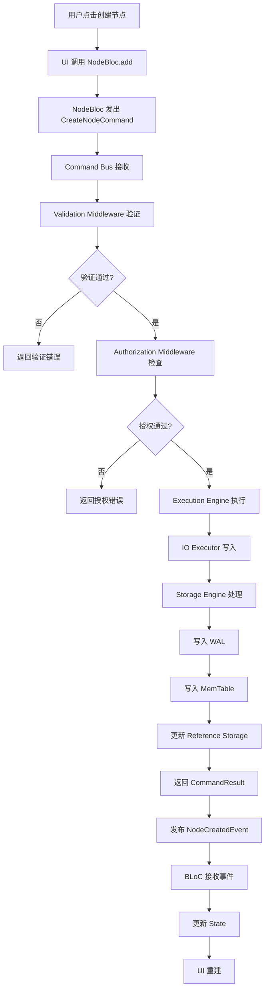
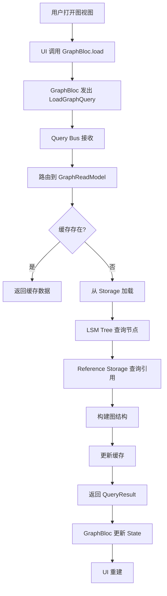

# 数据流设计

## 1. 概述

### 1.1 职责
本文档描述 Node Graph Notebook 中的数据流动路径，包括：
- 写操作数据流（Command）
- 读操作数据流（Query）
- 事件传播流（Event）
- UI 更新流（State）

### 1.2 目标
- **清晰性**: 数据流动路径清晰可追踪
- **可预测性**: 相同操作产生相同结果
- **性能**: 最小化数据复制和转换
- **一致性**: 保证数据最终一致性

### 1.3 关键挑战
- **状态同步**: 多个 BLoC 需要共享状态
- **事件传播**: 跨 BLoC 的事件通知
- **数据一致性**: 写操作后的读一致性
- **延迟最小化**: 减少用户感知延迟

## 2. 数据流架构

### 2.1 整体数据流

```
┌─────────────────────────────────────────────────────────────┐
│                       数据流概览                             │
└─────────────────────────────────────────────────────────────┘

用户操作
   ↓
┌─────────────┐
│  UI Layer   │
└─────────────┘
   ↓
┌─────────────┐
│ BLoC Layer  │ ←→ EventBus ←→ (跨 BLoC 通信)
└─────────────┘
   ↓              ↙              ↘
Command Bus    Query Bus    Direct Service
   ↓              ↓              ↓
┌─────────────────────────────────────────┐
│         Execution Engine                 │
└─────────────────────────────────────────┘
   ↓
┌─────────────────────────────────────────┐
│         Storage Engine                   │
└─────────────────────────────────────────┘
   ↓
┌─────────────────────────────────────────┐
│         File System                     │
└─────────────────────────────────────────┘
```

## 3. 写操作数据流

### 3.1 创建节点流程



### 3.2 数据转换

```dart
// UI → BLoC: 用户输入转换为 Command
final command = CreateNodeCommand(
  type: NodeType.concept,
  data: NodeData(
    title: '新概念',
    content: '',
  ),
);

// BLoC → Command Bus: Command 传递
await commandBus.execute(command);

// Command Bus → Storage: Command 转换为存储操作
final node = Node(
  id: generateId(),
  type: command.type,
  data: command.data,
  createdAt: DateTime.now(),
  updatedAt: DateTime.now(),
  version: 1,
);

// Storage → File System: 序列化
final json = node.toJson();
final file = File('data/nodes/${node.id}.json');
await file.writeAsString(json);
```

### 3.3 并发安全

**写操作串行化**:
- 所有写操作进入单一队列
- 按到达顺序执行
- 保证原子性和一致性

```dart
class WriteQueue {
  final Queue<Future<void> Function()> _queue = Queue();
  bool _isProcessing = false;

  Future<T> enqueue<T>(Future<T> Function() operation) async {
    final completer = Completer<T>();
    _queue.add(() async {
      final result = await operation();
      completer.complete(result);
    });

    _processQueue();
    return completer.future;
  }

  void _processQueue() async {
    if (_isProcessing || _queue.isEmpty) return;
    _isProcessing = true;

    while (_queue.isNotEmpty) {
      final operation = _queue.removeFirst();
      await operation();
    }

    _isProcessing = false;
  }
}
```

## 4. 读操作数据流

### 4.1 加载图数据流程



### 4.2 Read Model 设计

**GraphReadModel**:
```dart
class GraphReadModel {
  final NodeRepository _nodeRepo;
  final GraphRepository _graphRepo;
  final Map<String, GraphData> _cache = {};

  Future<GraphData> getGraph(String graphId) async {
    // 检查缓存
    if (_cache.containsKey(graphId)) {
      return _cache[graphId]!;
    }

    // 从存储加载
    final nodes = await _nodeRepo.getNodesInGraph(graphId);
    final references = await _graphRepo.getReferences(graphId);

    // 构建图数据
    final graphData = GraphData(
      nodes: nodes,
      references: references,
    );

    // 更新缓存
    _cache[graphId] = graphData;

    return graphData;
  }

  void invalidate(String graphId) {
    _cache.remove(graphId);
  }
}
```

### 4.3 缓存策略

**多级缓存**:
```
L1: BLoC State (内存, 最快)
  ↓ (miss)
L2: Read Model Cache (内存, 快)
  ↓ (miss)
L3: Storage Engine (磁盘/内存混合, 中等)
  ↓ (miss)
L4: File System (磁盘, 慢)
```

**缓存失效**:
- 主动失效: 写操作成功后通知 Read Model
- 被动失效: TTL 过期
- 预加载: 预测用户操作提前加载

## 5. 事件传播流

### 5.1 EventBus 架构

```dart
class AppEventBus {
  final StreamController<AppEvent> _controller =
      StreamController.broadcast();

  Stream<AppEvent> get stream => _controller.stream;

  void publish(AppEvent event) {
    _controller.add(event);
  }
}

abstract class AppEvent {
  final DateTime timestamp;
  AppEvent() : timestamp = DateTime.now();
}

class NodeCreatedEvent extends AppEvent {
  final String nodeId;
  final NodeType type;
  NodeCreatedEvent({required this.nodeId, required this.type});
}
```

### 5.2 事件订阅

```dart
// GraphBloc 订阅节点变更
class GraphBloc extends Bloc<GraphEvent, GraphState> {
  final AppEventBus _eventBus;
  StreamSubscription? _subscription;

  GraphBloc(this._eventBus) : super(GraphInitial()) {
    _subscription = _eventBus.stream.listen((event) {
      if (event is NodeDataChangedEvent) {
        // 节点数据变更，更新图
        add(UpdateGraphEvent(event.changedNodes));
      } else if (event is GraphRelationChangedEvent) {
        // 图关系变更，更新引用
        add(UpdateReferencesEvent(event.relations));
      }
    });
  }

  @override
  Future<void> close() {
    _subscription?.cancel();
    return super.close();
  }
}
```

### 5.3 事件流图

```
CommandBus.execute()
       ↓
   成功执行
       ↓
   发布事件 ──────→ EventBus.broadcast()
       ↓                      ↓
   直接更新 State      订阅者接收
       ↓                      ↓
   当前 BLoC         其他 BLoC
       ↓                      ↓
   UI 重建            更新 State
                          ↓
                       UI 重建
```

## 6. UI 更新流

### 6.1 BLoC 状态更新

```dart
// NodeBloc 处理命令结果
void _onCommandResult(CommandResult result) {
  if (result.isSuccess) {
    // 更新状态
    emit(state.copyWith(
      nodes: {...state.nodes, result.node},
      loading: false,
    ));

    // 通知其他 BLoC
    _eventBus.publish(NodeDataChangedEvent(
      changedNodes: [result.node],
      action: DataChangeAction.create,
    ));
  } else {
    // 错误处理
    emit(state.copyWith(
      error: result.error,
      loading: false,
    ));
  }
}
```

### 6.2 UI 重建优化

**选择性重建**:
```dart
// 使用 BlocBuilder 的 buildWhen
BlocBuilder<NodeBloc, NodeState>(
  buildWhen: (previous, current) {
    // 只在特定节点变化时重建
    return current.selectedNodeId == widget.nodeId;
  },
  builder: (context, state) {
    return NodeWidget(node: state.selectedNode);
  },
);
```

**局部更新**:
```dart
// 使用 context.watch 监听特定属性
final node = context.watch<NodeState>().selectedNode;
```

## 7. 数据一致性保证

### 7.1 写后读一致性

**策略**: 完成写操作后等待存储确认

```dart
Future<CommandResult> execute(CreateNodeCommand command) async {
  // 执行写操作
  final node = await _storage.createNode(command.data);

  // 等待持久化确认
  await _storage.flush();

  // 返回结果
  return CommandResult.success(node);
}
```

### 7.2 最终一致性

**场景**: EventBus 异步传播

```dart
// Command Bus 立即返回
await commandBus.execute(command);

// EventBus 异步传播事件
_eventBus.publish(NodeCreatedEvent(...));

// Read Model 稍后更新
// UI 最终会显示最新状态
```

### 7.3 冲突解决

**乐观锁**:
```dart
class Node {
  final String id;
  final int version;

  Node update(NodeData newData) {
    return Node(
      id: id,
      version: version + 1,  // 版本递增
      data: newData,
    );
  }
}

// 存储时检查版本
Future<void> save(Node node) async {
  final current = await _storage.getNode(node.id);
  if (current.version != node.version - 1) {
    throw ConflictException('版本冲突');
  }
  await _storage.save(node);
}
```

## 8. 性能优化

### 8.1 批量操作

```dart
// 批量创建节点
Future<void> createNodes(List<NodeData> dataList) async {
  final commands = dataList
      .map((data) => CreateNodeCommand(data: data))
      .toList();

  await commandBus.executeBatch(commands);
}
```

### 8.2 异步流水线

```
UI 线程                    执行线程                    IO 线程
   │                          │                          │
   └── 发送 Command ────────→ 队列                        │
                              │                          │
                              └───────────────────────→ 执行
                                                         │
   ←──────────────────────── 返回 Result ←────────────────┘
   │
   └── 更新 UI
```

### 8.3 数据预加载

```dart
class GraphBloc extends Bloc<GraphEvent, GraphState> {
  // 预加载相邻节点
  void _preloadAdjacentNodes(Node node) {
    final neighbors = _graphService.getNeighbors(node.id);
    for (final neighborId in neighbors) {
      add(LoadNodeEvent(neighborId));
    }
  }
}
```

## 9. 错误处理流

### 9.1 错误传播

```
Command 执行失败
       ↓
   CommandResult.error
       ↓
   BLoC 捕获
       ↓
   emit(state.withError())
       ↓
   UI 显示错误
```

### 9.2 错误恢复

```dart
Future<CommandResult> execute(Command command) async {
  try {
    return await _executeCommand(command);
  } on ConflictException catch (e) {
    // 冲突，尝试重试
    return await _retryWithNewVersion(command);
  } on StorageException catch (e) {
    // 存储错误，尝试恢复
    await _storage.recover();
    return await _executeCommand(command);
  } catch (e) {
    // 未知错误
    return CommandResult.error(e.toString());
  }
}
```

## 10. 关键文件清单

```
lib/core/
├── events/
│   ├── app_events.dart          # 事件定义
│   └── event_bus.dart           # EventBus 实现
├── command_bus/
│   └── data_flow.dart           # Command 数据流
└── query_bus/
    └── data_flow.dart           # Query 数据流
```

## 11. 参考资料

### CQRS 模式
- Martin Fowler - CQRS
- Microsoft - CQRS Pattern

### 事件驱动架构
- Martin Fowler - Event Sourcing
- Domain-Driven Design - Event

### 数据一致性
- CAP Theorem
- Eventual Consistency Patterns

---

**文档所有者**: Node Graph Notebook 架构组
**最后更新**: 2025-01-14
