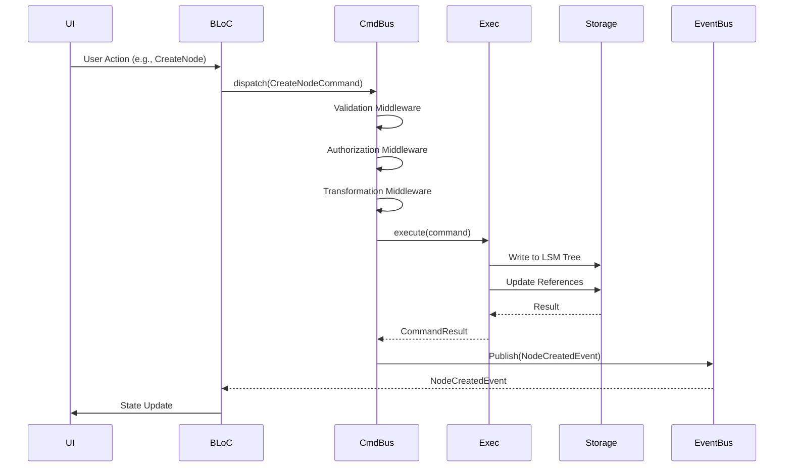
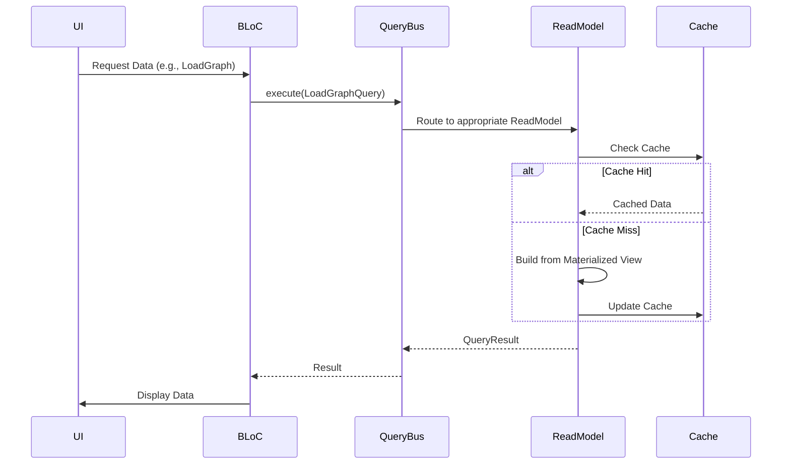

# 系统架构设计

## 1. 概述

### 1.1 职责
本文档描述 Node Graph Notebook 的整体系统架构，包括：
- 系统的分层结构
- 各层的职责和边界
- 组件间的依赖关系
- 数据流动路径

### 1.2 目标
- **模块化**: 每个子系统有清晰的边界和职责
- **可扩展性**: 支持插件扩展和功能增强
- **性能**: 支持千万级节点的高效处理
- **可维护性**: 代码结构清晰，易于理解和修改

### 1.3 关键挑战
- **状态管理**: 复杂的图结构需要高效的状态管理
- **并发访问**: 多个操作同时访问共享数据
- **渲染性能**: 大规模节点的实时渲染
- **数据一致性**: 图关系的完整性保证

## 2. 架构设计

### 2.1 整体架构

系统采用**分层架构**结合**CQRS 模式**：

```
┌─────────────────────────────────────────────────────────────┐
│                        Presentation Layer                    │
│  ┌─────────────┐  ┌─────────────┐  ┌─────────────────────┐  │
│  │ Flutter UI  │  │ Flame Views │  │   Plugin UI Hooks   │  │
│  └─────────────┘  └─────────────┘  └─────────────────────┘  │
└─────────────────────────────────────────────────────────────┘
                            ↓↑
┌─────────────────────────────────────────────────────────────┐
│                      Application Layer (BLoC)                │
│  ┌─────────────┐  ┌─────────────┐  ┌─────────────────────┐  │
│  │  NodeBloc   │  │  GraphBloc  │  │   ConverterBloc     │  │
│  │  SearchBloc │  │    UIBloc   │  │   (other BLoCs)     │  │
│  └─────────────┘  └─────────────┘  └─────────────────────┘  │
└─────────────────────────────────────────────────────────────┘
                            ↓↑
┌─────────────────────────────────────────────────────────────┐
│                      Domain Layer (CQRS)                    │
│  ┌─────────────────────┐  ┌─────────────────────────────┐  │
│  │    Command Bus      │  │      Query Bus              │  │
│  │  (Write Operations) │  │   (Read Operations)         │  │
│  └─────────────────────┘  └─────────────────────────────┘  │
└─────────────────────────────────────────────────────────────┘
                            ↓↑
┌─────────────────────────────────────────────────────────────┐
│                   Execution Layer                           │
│  ┌───────────────────────────────────────────────────────┐  │
│  │            Execution Engine                           │  │
│  │  ┌────────────┐  ┌────────────┐  ┌────────────┐     │  │
│  │  │ IO Executor│  │ CPU Executor│  │ GPU Executor│    │  │
│  │  └────────────┘  └────────────┘  └────────────┘     │  │
│  └───────────────────────────────────────────────────────┘  │
└─────────────────────────────────────────────────────────────┘
                            ↓↑
┌─────────────────────────────────────────────────────────────┐
│                   Infrastructure Layer                      │
│  ┌───────────────────────────────────────────────────────┐  │
│  │              Storage Engine                            │  │
│  │  ┌──────────────┐  ┌──────────────────────────────┐  │  │
│  │  │  LSM Tree    │  │   Reference Storage          │  │  │
│  │  │  (Node Data) │  │   (Graph Structure)          │  │  │
│  │  └──────────────┘  └──────────────────────────────┘  │  │
│  │  ┌──────────────────────────────────────────────────┐│  │
│  │  │         Version Control (Append-only)            ││  │
│  │  └──────────────────────────────────────────────────┘│  │
│  └───────────────────────────────────────────────────────┘  │
└─────────────────────────────────────────────────────────────┘
                            ↓↑
┌─────────────────────────────────────────────────────────────┐
│                      File System                            │
│  data/nodes/    data/graphs/    data/versions/              │
└─────────────────────────────────────────────────────────────┘
```

### 2.2 分层职责

#### Presentation Layer (表现层)
**职责**:
- 渲染 UI 组件
- 处理用户交互
- 显示应用状态

**主要组件**:
- `Flutter UI`: 标准的 Flutter widgets
- `Flame Views`: 基于 Flame 游戏引擎的图形可视化
- `Plugin UI Hooks`: 插件扩展的 UI 组件

**约束**:
- 不包含业务逻辑
- 通过 BLoC 与应用层通信
- 不直接访问存储层

#### Application Layer (应用层)
**职责**:
- 管理应用状态
- 协调业务流程
- 处理 UI 事件

**主要组件**:
- `NodeBloc`: 节点状态管理
- `GraphBloc`: 图关系状态管理
- `SearchBloc`: 搜索功能
- `UIBloc`: UI 状态（侧边栏、对话框等）
- `ConverterBloc`: 导入导出

**约束**:
- 不包含复杂业务逻辑
- 通过 Command/Query Bus 与领域层通信
- 保持状态最小化

#### Domain Layer (领域层)
**职责**:
- 实现核心业务逻辑
- 执行命令（写操作）
- 处理查询（读操作）

**主要组件**:
- `Command Bus`: 命令分发和执行
- `Query Bus`: 查询路由
- `Commands`: 具体的命令实现
- `Queries`: 具体的查询实现

**约束**:
- 独立于 UI 框架
- 不直接依赖存储实现
- 通过接口定义存储访问

#### Execution Layer (执行层)
**职责**:
- 异步执行命令和查询
- 优化资源使用（IO/CPU/GPU）
- 管理执行队列

**主要组件**:
- `Execution Engine`: 执行引擎总控
- `IO Executor`: 异步 IO 操作
- `CPU Executor`: CPU 密集型计算
- `GPU Executor`: GPU 加速计算（如渲染）

**约束**:
- 不包含业务逻辑
- 只负责执行调度
- 提供执行结果回调

#### Infrastructure Layer (基础设施层)
**职责**:
- 数据持久化
- 并发控制
- 事务管理

**主要组件**:
- `Storage Engine`: 存储引擎
  - `LSM Tree`: 节点数据存储
  - `Reference Storage`: 图关系存储
- `Version Control`: 版本历史管理
- `Concurrency Control`: 并发安全

**约束**:
- 提供稳定的存储 API
- 保证数据一致性
- 对上层透明

### 2.3 组件交互

#### 写操作流程（Command）



#### 读操作流程（Query）



## 3. 核心概念

### 3.1 Node（节点）
**定义**: 系统中的基本数据单元

**属性**:
- `id`: 唯一标识符
- `type`: 节点类型（concept, content, folder, etc.）
- `data`: 节点内容（标题、正文、元数据）
- `createdAt`: 创建时间
- `updatedAt`: 更新时间
- `version`: 版本号

**不变性**:
- Node 对象一旦创建不可变
- 修改操作创建新版本
- 版本链形成历史记录

### 3.2 Reference（引用）
**定义**: Node 之间的有向关系

**属性**:
- `sourceId`: 源节点 ID
- `targetId`: 目标节点 ID
- `type`: 引用类型（parent, child, link, etc.）
- `metadata`: 关系元数据

**特性**:
- 引用关系存储在独立的 Reference Storage
- 支持前向和反向查询
- 支持传递闭包计算

### 3.3 Graph（图）
**定义**: Node 和 Reference 的集合

**操作**:
- 添加/删除节点
- 添加/删除引用
- 查询可达节点
- 计算图分区

## 4. 架构模式

### 4.1 CQRS（命令查询职责分离）

**原理**:
- 写操作（Command）和读操作（Query）分离
- 写操作通过 Command Bus
- 读操作通过 Query Bus
- 读写使用不同的数据模型

**优势**:
- 读写性能独立优化
- 复杂查询不影响写入
- 易于扩展和缓存

### 4.2 Event Sourcing（事件溯源）

**原理**:
- 状态变更通过事件序列化
- 事件存储在 WAL（Write-Ahead Log）
- 状态可以通过重放事件重建

**应用**:
- Command 执行产生事件
- 事件发布到 EventBus
- 其他组件订阅事件并响应

### 4.3 Repository Pattern（仓储模式）

**原理**:
- 存储访问通过抽象接口
- 业务逻辑不依赖具体存储实现

**应用**:
- `NodeRepository`: 节点数据访问
- `GraphRepository`: 图关系访问

## 5. 扩展点

### 5.1 Command Bus 中间件
- 验证中间件
- 授权中间件
- 转换中间件
- 审计中间件

### 5.2 Query Bus 扩展
- 自定义 Read Model
- 查询优化器
- 结果缓存策略

### 5.3 Execution Layer 扩展
- 新的执行器类型
- 调度策略
- 资源管理

### 5.4 Storage Engine 扩展
- 新的存储后端
- 索引策略
- 压缩算法

## 6. 性能考虑

### 6.1 写路径优化
- LSM Tree 批量写入
- WAL 异步刷新
- MemTable 减少磁盘 IO

### 6.2 读路径优化
- Read Model 预计算
- 物化视图缓存
- 布隆过滤器加速查找

### 6.3 渲染优化
- 视口剔除
- LOD 系统
- 空间分区
- 对象池

## 7. 关键文件清单

### 新增文件（Phase 1）
```
lib/core/
├── command_bus/
│   ├── command.dart              # Command 基类
│   ├── command_bus.dart          # Command Bus 实现
│   ├── command_context.dart      # 执行上下文
│   ├── command_result.dart       # 执行结果
│   └── middleware/
│       ├── middleware.dart       # 中间件基类
│       ├── validation.dart       # 验证中间件
│       └── authorization.dart    # 授权中间件
├── query_bus/
│   ├── query.dart                # Query 基类
│   ├── query_bus.dart            # Query Bus 实现
│   └── read_models/
│       └── base_read_model.dart  # Read Model 基类
├── execution/
│   ├── execution_engine.dart     # 执行引擎
│   ├── io_executor.dart          # IO 执行器
│   ├── cpu_executor.dart         # CPU 执行器
│   └── gpu_executor.dart         # GPU 执行器
└── storage/
    ├── storage_engine.dart       # 存储引擎接口
    ├── lsm_tree/
    │   ├── mem_table.dart        # 内存表
    │   ├── sstable.dart          # 不可变表
    │   ├── wal.dart              # 预写日志
    │   └── bloom_filter.dart     # 布隆过滤器
    ├── reference_storage.dart    # 引用存储
    └── version_control.dart      # 版本控制
```

## 8. 参考资料

### 架构模式
- Martin Fowler - CQRS Pattern
- Martin Fowler - Event Sourcing
- Eric Evans - Domain-Driven Design

### 存储引擎
- LevelDB Architecture
- RocksDB Documentation
- LSM Tree Paper (O'Neil et al., 1996)

### 并发控制
- MVCC in PostgreSQL
- Concurrency in Dart Isolates

---

**文档所有者**: Node Graph Notebook 架构组
**最后更新**: 2025-01-14
