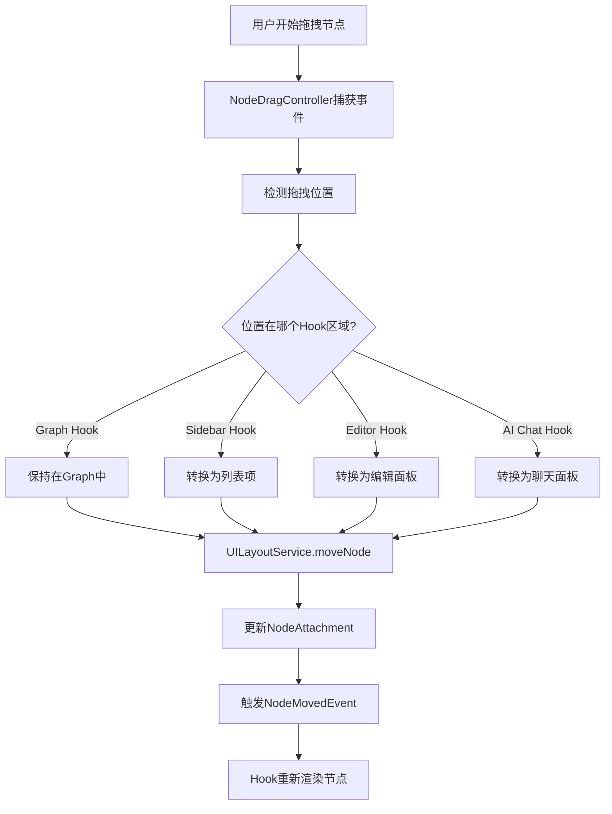

# Flowing UI 架构设计文档

## 1. 核心概念

### 1.1 什么是 Flowing UI？

**Flowing UI** 是一种节点可以在不同UI上下文之间自由流动的交互范式：

- **节点即内容**：节点是唯一的内容单元
- **Hook即视图**：UI组件只是节点在不同Hook点的表现形式
- **流动即交互**：用户通过拖拽节点在不同Hook之间流动来完成操作

### 1.2 设计哲学

```
传统UI模式：
Button → Dialog → Form → Save → Update UI

Flowing UI模式：
Node (in Graph) → Drag → Node (in Sidebar) → Edit → Drag → Node (in Graph)
```

**核心原则：**
1. **单一数据源**：节点永远只有一个真实的存储位置
2. **多重视图**：节点可以在多个Hook中以不同形式呈现
3. **无缝流动**：拖拽是节点在不同视图间转换的主要交互

---

## 2. 交互流程

### 2.1 节点流动的基本流程



### 2.2 具体交互示例

#### 示例1：从Graph拖到Sidebar

```
1. 用户在Graph中拖拽节点
   ↓
2. NodeDragController检测拖拽位置
   ↓
3. 检测到拖拽目标在Sidebar区域
   ↓
4. 调用 UILayoutService.moveNode(
       nodeId: "node-123",
       fromHookId: "graph",
       toHookId: "sidebar.nodeList"
     )
   ↓
5. UILayoutService更新NodeAttachment
   ↓
6. Sidebar Hook重新渲染，显示节点为列表项
   ↓
7. Graph Hook不再渲染该节点
```

#### 示例2：从Sidebar拖回Graph

```
1. 用户在Sidebar中拖拽节点项
   ↓
2. NodeDragController检测拖拽位置
   ↓
3. 检测到拖拽目标在Graph区域
   ↓
4. 调用 UILayoutService.moveNode(
       nodeId: "node-123",
       fromHookId: "sidebar.nodeList",
       toHookId: "graph"
     )
   ↓
5. UILayoutService更新NodeAttachment
   ↓
6. Graph Hook重新渲染，显示节点为图形组件
   ↓
7. Sidebar Hook不再渲染该节点
```

---

## 3. Hook 点定义

### 3.1 核心 Hook 点

| Hook ID | 用途 | 节点表现形式 | 交互能力 |
|---------|------|-------------|---------|
| `graph` | 主图形视图 | 可交互的图形组件（矩形/圆形） | 拖拽、点击、双击、右键 |
| `sidebar.nodeList` | 侧边栏节点列表 | 列表项（图标+标题） | 点击、拖拽、右键 |
| `sidebar.nodeEditor` | 侧边栏编辑面板 | Markdown编辑器 | 编辑、保存、拖拽手柄 |
| `sidebar.aiChat` | AI聊天面板 | 聊天界面 | 发送消息、拖拽手柄 |
| `main.toolbar` | 主工具栏 | 工具按钮 | 点击、拖拽 |
| `contextMenu.node` | 节点右键菜单 | 菜单项 | 点击 |

### 3.2 Hook 渲染器责任

```dart
abstract class HookRenderer {
  /// 渲染附加到此Hook的节点
  Widget render(Hook hook, Map<String, dynamic> context);

  /// 处理节点拖入此Hook
  void onNodeDropped(String nodeId, DragEvent event);

  /// 提供拖拽手柄（可选）
  Widget? buildDragHandle(String nodeId);
}
```

---

## 4. 节点元数据

### 4.1 Flowing UI 相关元数据

```yaml
# 节点的Flowing UI状态
hooks:
  current: "graph"  # 当前所在的Hook
  history:          # Hook历史记录
    - hook: "sidebar.nodeList"
      timestamp: "2026-04-02T10:00:00Z"
      duration: 300  # 停留时长（秒）

# 节点的UI偏好设置
ui:
  preferredViewMode: "titleWithPreview"
  preferredColor: "#3B82F6"
  preferredSize:
    width: 250
    height: 120

# 节点的交互能力
capabilities:
  draggable: true
  editable: true
  connectable: true
  aiCapable: false
```

### 4.2 NodeAttachment 扩展

```dart
class NodeAttachment {
  /// 节点ID
  final String nodeId;

  /// 当前附加的Hook ID
  final String hookId;

  /// 在Hook中的位置（Hook特定的坐标系统）
  final LocalPosition position;

  /// 节点在Hook中的元数据（尺寸、状态等）
  final Map<String, dynamic> metadata;

  /// 进入此Hook的时间
  final DateTime enteredAt;

  /// 节点的渲染状态
  final NodeRenderState renderState;
}

enum NodeRenderState {
  /// 正在渲染
  rendering,

  /// 已暂停（不在视口内）
  suspended,

  /// 正在拖拽
  dragging,

  /// 即将离开此Hook
  leaving,
}
```

---

## 5. 架构组件

### 5.1 NodeDragController

**职责：**
- 捕获 Flame 节点组件的拖拽事件
- 检测拖拽目标和可放置的 Hook 区域
- 触发节点移动到目标 Hook
- 提供视觉反馈（拖拽阴影、高亮目标区域）

**核心 API：**
```dart
class NodeDragController extends Component {
  /// 开始拖拽节点
  void startDrag(NodeComponent nodeComponent, DragStartEvent event);

  /// 更新拖拽位置
  void updateDrag(DragUpdateEvent event);

  /// 结束拖拽（尝试放置到目标Hook）
  void endDrag(DragEndEvent event);

  /// 取消拖拽
  void cancelDrag();

  /// 检测位置是否在某个Hook区域内
  String? detectHookAtPosition(Offset screenPosition);

  /// 获取Hook的屏幕边界
  Rect? getHookBounds(String hookId);
}
```

### 5.2 UILayoutService 扩展

**新增方法：**
```dart
class UILayoutService {
  /// 将节点从一个Hook移动到另一个Hook
  Future<void> moveNode({
    required String nodeId,
    String? fromHookId,  // null = 自动检测
    required String toHookId,
    Map<String, dynamic>? metadata,
  });

  /// 获取节点当前所在的Hook
  String? getNodeHook(String nodeId);

  /// 获取指定屏幕位置下的Hook
  String? getHookAtPosition(Offset screenPosition);

  /// 获取Hook的屏幕边界
  Rect? getHookBounds(String hookId);

  /// 订阅节点移动事件
  Stream<NodeMovedEvent> get nodeMovedStream;
}
```

### 5.3 Hook 渲染器接口

```dart
abstract class HookRendererBase {
  /// 渲染Hook内容
  Widget buildContent(BuildContext context, HookContext hookContext);

  /// 处理节点拖入
  void onNodeDropped(String nodeId, DragEvent event);

  /// 提供拖拽手柄（可选）
  Widget? buildDragHandle(BuildContext context, String nodeId);

  /// 验证节点是否可以放置到此Hook
  bool canAcceptNode(String nodeId);

  /// 节点进入Hook时的回调
  void onNodeEnter(String nodeId);

  /// 节点离开Hook时的回调
  void onNodeLeave(String nodeId);
}
```

---

## 6. 事件系统

### 6.1 NodeMovedEvent

```dart
class NodeMovedEvent extends AppEvent {
  /// 移动的节点ID
  final String nodeId;

  /// 源Hook ID
  final String? fromHookId;

  /// 目标Hook ID
  final String toHookId;

  /// 移动元数据
  final Map<String, dynamic>? metadata;

  /// 时间戳
  final DateTime timestamp;
}
```

### 6.2 事件传播流程

```
NodeDragController.endDrag()
  ↓
UILayoutService.moveNode()
  ↓
更新 NodeAttachment
  ↓
发布 NodeMovedEvent 到 CommandBus.eventStream
  ↓
Graph Hook 订阅者 → 移除节点
Sidebar Hook 订阅者 → 添加节点
```

---

## 7. 视觉反馈

### 7.1 拖拽反馈组件

```dart
/// 拖拽时的"幽灵"图像
class DragFeedbackComponent extends PositionComponent {
  /// 渲染半透明节点图像
  @override
  void render(Canvas canvas) {
    canvas.drawImageRect(
      _ghostImage,
      srcRect,
      dstRect,
      Paint()..color = Colors.white.withOpacity(0.5),
    );
  }
}

/// 目标区域高亮
class HookDropZoneHighlight extends Component {
  /// 高亮目标Hook区域
  void highlightZone(Rect zone) {
    // 绘制虚线边框
    // 绘制背景高亮
  }

  /// 清除高亮
  void clearHighlight();
}
```

### 7.2 视觉反馈状态机

```
状态：IDLE
  ↓ 用户开始拖拽
状态：DRAGGING
  ├─ 显示幽灵图像
  ├─ 高亮可放置的Hook
  └─ 实时更新位置
  ↓ 用户释放鼠标
状态：PLACING
  ├─ 验证目标Hook
  ├─ 触发节点移动
  └─ 播放放置动画
  ↓ 放置完成
状态：IDLE
```

---

## 8. 性能优化

### 8.1 空间索引优化

```dart
/// Hook区域的空间索引
class HookSpatialIndex {
  /// 快速查找位置下的Hook
  String? findHookAtPosition(Offset position);

  /// 注册Hook区域
  void registerHook(String hookId, Rect bounds);

  /// 更新Hook区域（响应窗口大小变化）
  void updateHook(String hookId, Rect newBounds);
}
```

### 8.2 渲染优化

- **延迟渲染**：只有在视口内的节点才渲染
- **LOD（Level of Detail）**：根据距离调整渲染细节
- **纹理缓存**：缓存节点的渲染图像
- **脏标记**：只重新渲染变化的节点

---

## 9. 扩展性

### 9.1 添加新的Hook

```dart
// 1. 定义Hook ID
const String myCustomHook = 'myPlugin.customHook';

// 2. 实现Hook渲染器
class MyCustomHookRenderer extends HookRendererBase {
  @override
  Widget buildContent(BuildContext context, HookContext hookContext) {
    // 返回UI组件
  }

  @override
  bool canAcceptNode(String nodeId) {
    // 验证节点是否可以放置
  }
}

// 3. 注册到UILayoutService
layoutService.registerHook(
  myCustomHook,
  MyCustomHookRenderer(),
);
```

### 9.2 自定义节点类型

```dart
// 定义自定义节点类型
class AgentNode extends Node {
  final List<String> capabilities;
  final AgentStatus status;

  // Agent节点可以流动到AI Chat Hook
  @override
  bool canFlowTo(String hookId) {
    if (hookId == 'sidebar.aiChat') return true;
    return super.canFlowTo(hookId);
  }
}
```

---

## 10. 测试策略

### 10.1 单元测试

```dart
testWidgets('Node can be dragged from graph to sidebar', (tester) async {
  // 1. 创建测试节点
  final node = await createTestNode();

  // 2. 模拟拖拽到sidebar
  await tester.drag(find.byType(NodeComponent), Offset(-500, 0));

  // 3. 验证节点在sidebar中
  expect(find.text(node.title), findsOneWidget);
});
```

### 10.2 集成测试

```dart
test('NodeDragController detects hook at position', () {
  final controller = NodeDragController();
  final hookId = controller.detectHookAtPosition(Offset(100, 100));
  expect(hookId, equals('sidebar.nodeList'));
});
```

---

## 11. 已知限制

### 11.1 当前限制

1. **单节点拖拽**：暂不支持批量拖拽多个节点
2. **单向流动**：节点只能从一个Hook流动到另一个，不能同时存在多个Hook
3. **同步移动**：节点移动是同步操作，暂不支持异步转换

### 11.2 未来改进

1. **批量操作**：支持多选和批量拖拽
2. **分身节点**：同一节点可以在多个Hook中同时显示（只读副本）
3. **异步转换**：节点转换时显示加载状态
4. **撤销/重做**：支持节点流动的撤销操作

---

## 12. 总结

Flowing UI 架构实现了：

✅ **节点即内容**：统一的节点模型
✅ **Hook即视图**：灵活的视图系统
✅ **流动即交互**：直观的拖拽交互
✅ **事件驱动**：解耦的事件系统
✅ **高性能**：空间索引和渲染优化
✅ **可扩展**：插件化的Hook系统

**下一步：** 实现核心组件（NodeDragController、UILayoutService扩展、Hook渲染器）

---

**文档版本：** 1.0
**最后更新：** 2026-04-02
**作者：** Claude Code
